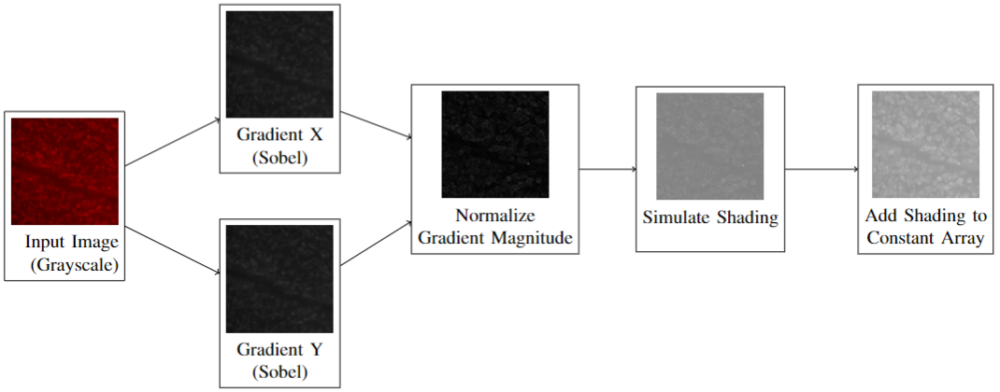
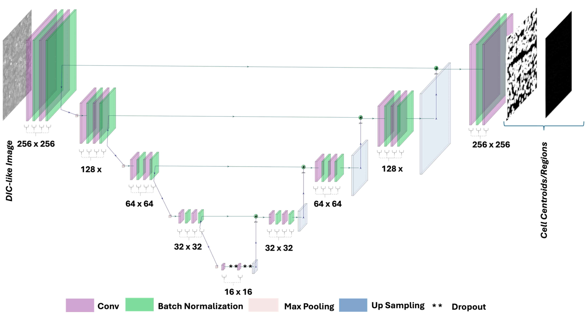
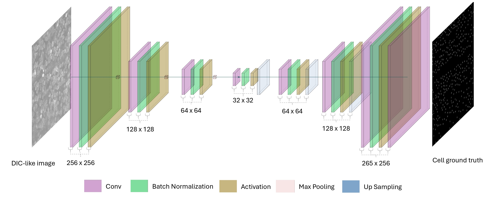
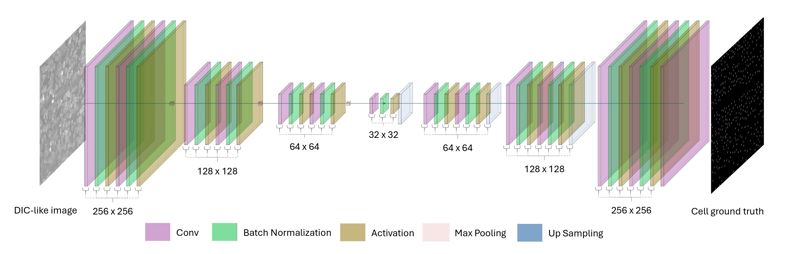
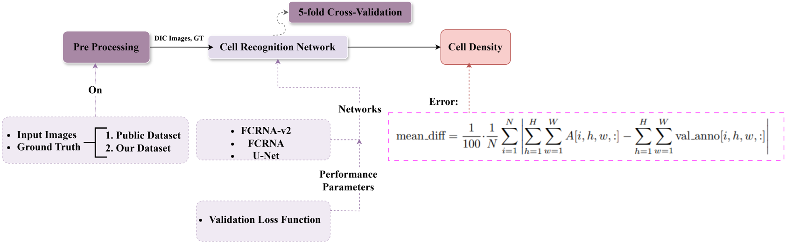

In this repository, we compare the performance of two networks ( FCRN-A, FCRN-A-v2, and U-Net) on our subjective problem.

# Project Title
Comparative Evaluation of Deep Learning Architectures for Retinal Ganglion Cell Counting: FCRN-A, FCRN-A-v2, and U-Net
---

## Table of Contents
- [Overview](#overview)
- [Installation](#installation)
- [Dataset](#Dataset)
- [Pre-processing](#Pre-processing)
- [Deep Learning Models](#Deep-Learning-Models)
- [Train on your own Dataset](#Train-on-your-own-Dataset)
- [Methodology](#Methodology)
- [Counting Methodologies](#Counting-Methodology)
- [Evaluation](#Evaluation)
- [License](#refrences)
- [Contact](#contact)

---


## Overview

This repository offers  deep learning methods for retinal ganglion cell (RGC) counting. It introduces advanced pre-processing techniques for both input and label datasets. The repository includes a synthetic dataset and a self-generated dataset of whole-mounted mouse retina images. 
We evaluate FCRN-A [3], our proposed FCRN-A-v2, and U-Net [2] model across both datasets and compare them using a local maxima counting method. 

---


## Installation

To run the training phase of this code, you'll need to set up a specific environment with the required dependencies. Follow these steps to create the environment:

1. Create the conda environment with the required TensorFlow version and additional dependencies:

   ```bash
   conda create -n tf-gpu-env tensorflow-gpu numpy=1.23.5

2. Activate the environment:

   ```bash
   conda activate tf-gpu-env

3. Once the environment is set up and activated, you can proceed with installing the  dependencies  and then training the code.

   ```bash
   bash install_dependencies.sh
   ```

    Or you can use:

    ```bash
    pip install -r requirements.txt
    ```

---


## Dataset

Both real and synthetic datasets are provided in ***real_dataset*** and ***synth_dataset*** folder of  this repository. 
The custom dataset, collected by Dalhousie University’s Department of Ophthalmology.
the subfolders in each include :

1. cells : input images
2. dots : annotated label images

## Pre-processing 
all pre-processing steps are visualized in ***visulize the preprocessing steps*** folder.

  
*Figure 1: Input image pre-processing steps*

----


## Deep Learning Models

The data augmentation code is provided in ***generator.ipynb*** file. The models architectures are provided in ***model.ipynb*** file.
  
*Figure 2: Architecture of U-Net*

  
*Figure 3: Architecture of FCRNA*


  
*Figure 4: Architecture of FCRNA-v2*

---

## Train on your own Dataset

Both the training codes of all networks on both datasets are provided in ***fcrna_fcrna_v2_unet_synth.ipynb*** and ***fcrna_fcrna_v2_unet_real.ipynb*** respectively in ***.zip** files.

---

##  Methodology

The methodology is presented below:  
  
*Figure 5: Framework of our proposed methodology*

---

## Counting Methodologies 
Local Maxima counting methodology is provided with name ***Local_Maxima.ipynb*** in this repository. The output results are programmed to be saved in the dataset folder.


---


## Evaluation
The evaluation is done based on the following metrics: 
- Cell diff: Which is the diffrence of real counts based on groundtruh and the local maxima counts devided by the real counts 
- Mean diff: This metric is introduced in Figure 5. 
---

## Refrences
1. N. Y. Gharaei, N. Gaikwad, D. Upadhyay, S. Sampalli, B. C. Chauhan, and A. J. Jamet. Comparative evaluation of deep learning architectures for retinal ganglion cell counting: FCRN-A, FCRN-A-v2, and U-Net. In 2024 International Conference on Machine Learning and Applications (ICMLA), Miami, FL, USA, Dec. 2024. Accepted for publication.
2. O. Ronneberger, P. Fischer, and T. Brox, “U-net: Convolutional networks for biomedical image segmentation,” in Medical image computing and computer-assisted intervention–MICCAI 2015: 18th international conference, Munich, Germany, October 5-9, 2015, proceedings, part III 18, Springer, 2015, pp. 234–241.
3. W. Xie, J. A. Noble, and A. Zisserman, “Microscopycell counting and detection with fully convolutional regression networks,” Computer methods in biomechanics and biomedical engineering: Imaging & Visualization, vol. 6, no. 3, pp. 283–292, 2018.

----


## Contact
Let me know if you need help with any specific section or adding more details! you can contact with us using the following email address:
1. Narges.yarahmadi@dal.ca

